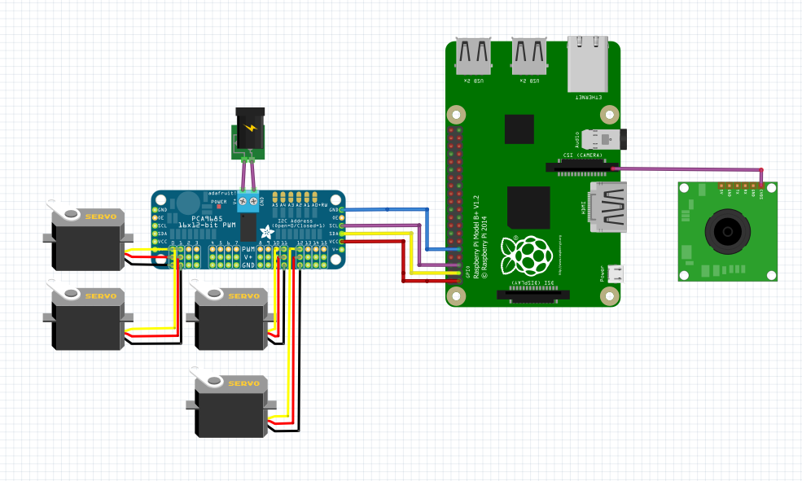
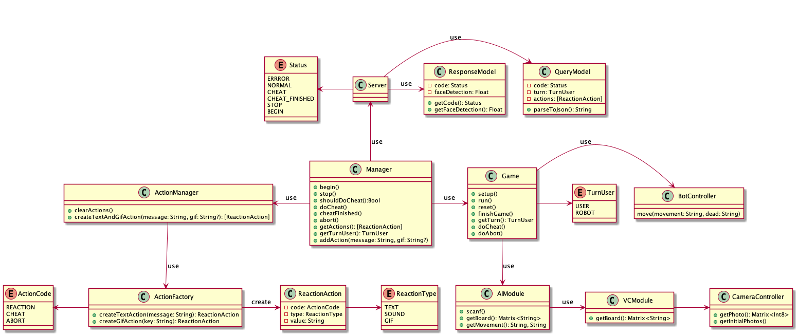
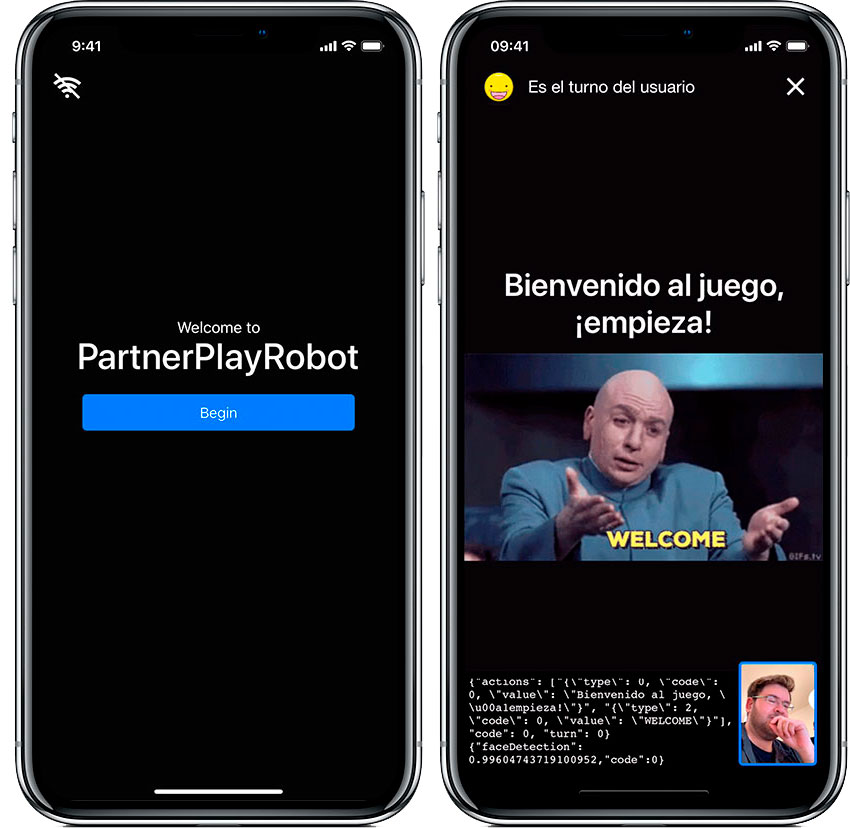
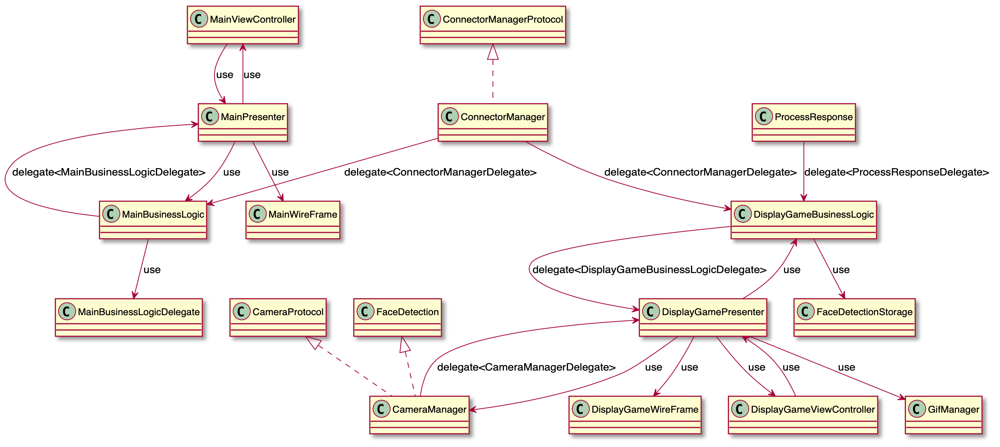

# PartnerPlayBot
Construcción y diseño de un robot capaz de jugar a Las Damas y realizar trampas.

## Introducción
Robot con el objetivo de ser compañero de juego para juegos de mesa, principalmente el juego de Las Damas. Resuelve partidas y es capaz de realizar trampas con ayuda de la inteligencia artificial y análisis del medio con técnicas de visión por computador. Este robot tendrá un brazo mecánico compuesto por dos ejes de libertad partiendo de un modelo de robot SCARA.

[](https://www.youtube.com/watch?v=XQy-w5hv_k0)


### Construcción hardware
El robot está formado por 4 servos, una Raspberry Pi 3B+ y materiales reutilizables. Para más información revisa el [Structable](./sources/Structable.pdf)



### Construcción software
Este proyecto ha sido desarrollado mediante dos programas, uno ubicado en la raspberry encargado de tomar decisiones y realizar los movimientos del hardware, que a su vez, se comunica con un programa cliente ubicado en un *smartphone* del cual recogemos datos y aportamos *feedback* de lo que esta ocurriendo durante la partida mediante imágenes, texto y voz.

## Software

### Programa del robot

#### Arquitectura

Se compone de una arquitectura basada en Modelo-Controlador con la intención de realizar su construcción lo más modular posible.
Se define un *Manager* que es un cordinador entre los diferentes gestores del juego. Por un lado tenemos el *Server* que será el encargado de la comunicación con el cliente y por otro el *Game* el cual se encargará del resto de la gestión del juego.



#### Uso del código

Para utilizar el código basta con añadirlo a la Raspberry, abrir un *terminal* en el direcctorio donde está alojado el código y ejecutar el script principal.

``` Bash
$ cd ~/destino
$ python3 script.py
```

-------------------------

### App Cliente
La app ha sido desarrollada en Swift 4 dando soporte a dispositivos cuya versión sea superior a iOS 11 dado que utiliza librerías de Visión y es la versión mínima soportada.

#### Capturas



#### Arquitectura

La nativa se ha desarrollado cumpliendo los estandares de arquitecturas limpias, en este caso usando la arquitectura VIPER especialmente orientada para el desarrollo movil en la plataforma iOS. Esta arquitectura define una serie de modulos que reparten las responsabilidades para cumplir con los principios SOLID.



#### Uso del código

Para ejecutar la app debes abrir el proyecto con Xcode10 y compilar con un simulador o dispositivo seleccionado, a continuación se abrirá la app automáticamente.


## Autores

> Alan Roldán Maillo
> Daniel Arias Zamudio
> Ruth Areli Martínez Reyes
> Sergio Morales Machado
