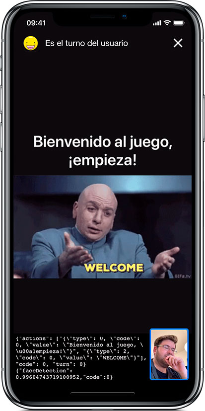

# PartnerPlayBot
Construcción y diseño de un robot capaz de jugar a Las Damas y realizar trampas.

## Introducción
Robot con el objetivo de ser compañero de juego para juegos de mesa, principalmente el juego de Las Damas. Resuelve partidas y es capaz de realizar trampas con ayuda de la inteligencia artificial y análisis del medio con técnicas de visión por computador. Este robot tendrá un brazo mecánico compuesto por dos ejes de libertad partiendo de un modelo de robot SCARA.

### Construcción hardware
El robot está formado por 4 servos, una Raspberry Pi 3B+ y materiales reutilizables. Para más información revisa el [Structable](./Structable.pdf)

### Construcción software
Este proyecto ha sido desarrollado mediante dos programas, uno ubicado en la raspberry encargado de tomar decisiones y realizar los movimientos del hardware, que a su vez, se comunica con un programa cliente ubicado en un *smartphone* del cual recogemos datos y aportamos *feedback* de lo que esta ocurriendo durante la partida mediante imágenes, texto y voz.

## Software
### Arquitectura del robot

### App Cliente
La app ha sido desarrollada en Swift 4 dando soporte a dispositivos cuya versión sea superior a iOS 11 dado que utiliza librerías de Visión y es la versión mínima soportada.

#### Capturas

#### Arquitectura app

### Uso del código
